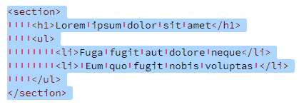
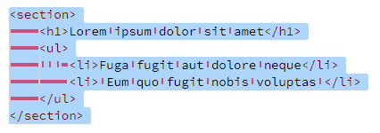
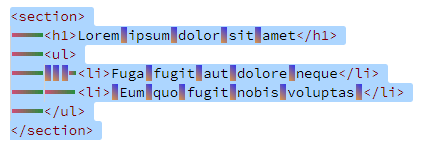

# Better White Space v2

Sublime-like tab and space rendering on selection for Visual Studio Code.

The space and tab characters are decorated with a [background linear gradient](https://developer.mozilla.org/en-US/docs/Web/CSS/gradient/linear-gradient). The tabs and space gradient can be different. You can specify a `from` and a `to` color. Default the `to` color is the same as the `from` color. The specified colors have a transparency value that can be different for the `from` and `to` colors.

## Tab Rendering


## Space Rendering



## Tabs + Spaces



This is especially useful to verify you're not mixing tabs & spaces.

## Gradients



Settings used for the image are specified for the `Default Light+` theme:

```json
  "betterWhitespaceV2.colors": {
    "[Default Light+]": {
      "color": "#f08000c0",
      "space.to": "#0000f0c0",
      "space.gradient.angle": 45,
      "space.gradient.width": 70,
      "space.gradient.height": 90,
      "tab": "#dc143cb3",
      "tab.to": "#008000c0"
    }
  }
```

## Extension Settings

A space and a tab have a size (width and height) in pixels on the screen. This box can be filled with a background gradient. You can specify how much (in %) of the box should be filled. This background rectangle is centered in the box of the space or tab.

The extension has the following settings:

* `betterWhitespaceV2.space.gradient.angle` : (number) Space Gradient Angle (degrees)  
  possible values: `[0,45,90,135,180,215,270,315]` (default: `0`)
* `betterWhitespaceV2.tab.gradient.angle` : (number) Tab Gradient Angle (degrees)  
  possible values: `[0,45,90,135,180,215,270,315]` (default: `90`)
* `betterWhitespaceV2.space.gradient.width` : (number) Space Gradient Width (%)  
  minimum: `0`, maximum: `100` (default: `25`)
* `betterWhitespaceV2.space.gradient.height` : (number) Space Gradient Height (%)  
  minimum: `0`, maximum: `100` (default: `40`)
* `betterWhitespaceV2.tab.gradient.width` : (number) Tab Gradient Width (%)  
  minimum: `0`, maximum: `100` (default: `95`)
* `betterWhitespaceV2.tab.gradient.height` : (number) Tab Gradient Height (%)  
  minimum: `0`, maximum: `100` (default: `20`)
* `betterWhitespaceV2.colors` : Colors for the gradient  
  An object with the following properties:
    * `color` : Space and Tab color default
    * `space` : Space (From) color, defaults to property `color`
    * `space.to` : Space To color, defaults to property `space`
    * `tab` : Tab (From) color, defaults to property `color`
    * `tab.to` : Tab To color, defaults to property `tab`
    * `light` : Colors for Light Themes  
      object with the properties: `color`, `space`, `space.to`, `tab`, `tab.to`
    * `dark` : Colors for Dark Themes  
      object with the properties: `color`, `space`, `space.to`, `tab`, `tab.to`
    * <code>[<em>themeName</em>]</code> : Colors for a named Theme  
      object with the properties: `color`, `space`, `space.to`, `tab`, `tab.to`

Depending on the setting `editor.tabSize` you have to change the setting `betterWhitespaceV2.tab.gradient.width` to get some clear separation between 2 tab characters. A value of 5% less can be enough.

The color setting objects can have next to the `color`, `space`, `space.to`, `tab`, `tab.to` properties also the properties:

* `space.gradient.angle`
* `tab.gradient.angle`
* `space.gradient.width`
* `space.gradient.height`
* `tab.gradient.width`
* `tab.gradient.height`

This allows you to customize each gradient differently.

The name of the used theme can be found in the setting: `workbench.colorTheme`

The name of the default theme is: `Default Dark+`

---

Credits to the [Power Mode](https://marketplace.visualstudio.com/items?itemName=hoovercj.vscode-power-mode) extension for the trick to use any CSS as decorator.